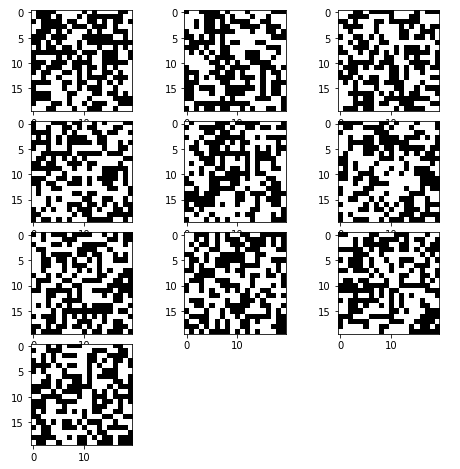
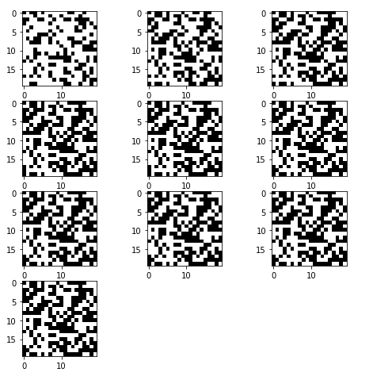
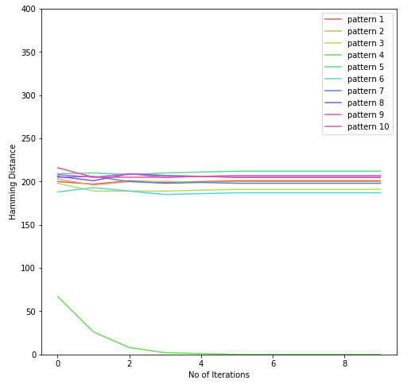
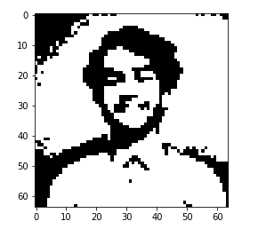
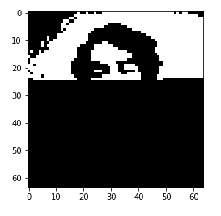
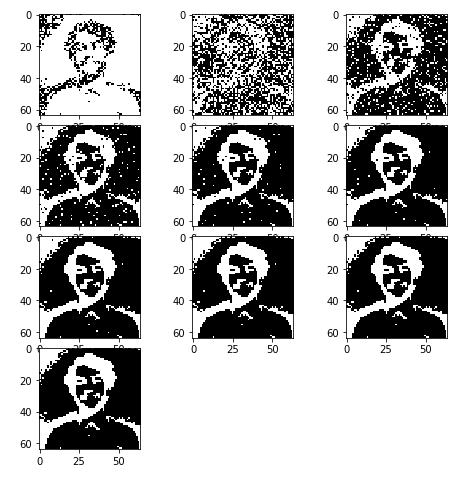
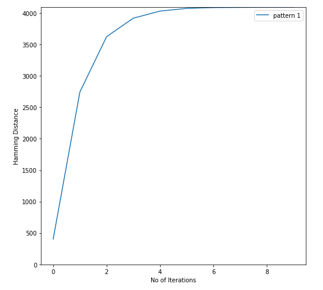
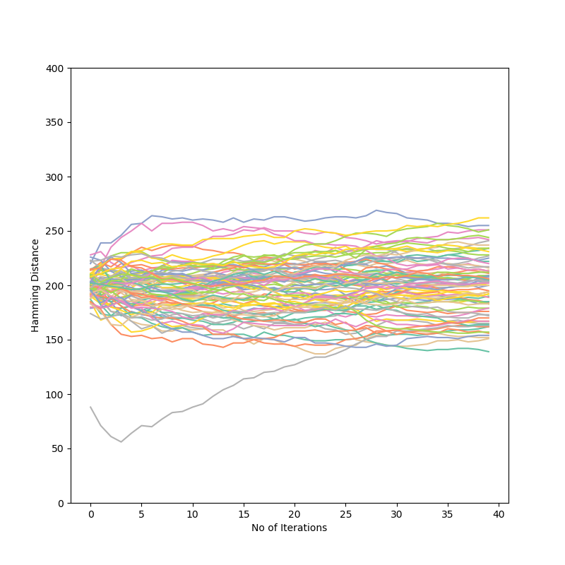

# Hopfield Network
Implementation of [Hopfield Neural Network](https://www.its.caltech.edu/~bi250c/papers/Hopfield-1982.pdf) in Python based on Hebbian Learning Algorithm

[Blog post on the same](https://duskybomb.github.io/2019/08/08/hopfield-nueral-network-implementation-in-python.html) 

## Example 1

## Example 2

## Implemented things:
 - Single pattern image
 - Multiple random pattern
 - Multiple pattern (digits)

## To do:
 - GPU implementation?

## Just a good graph

